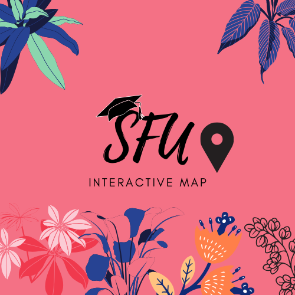
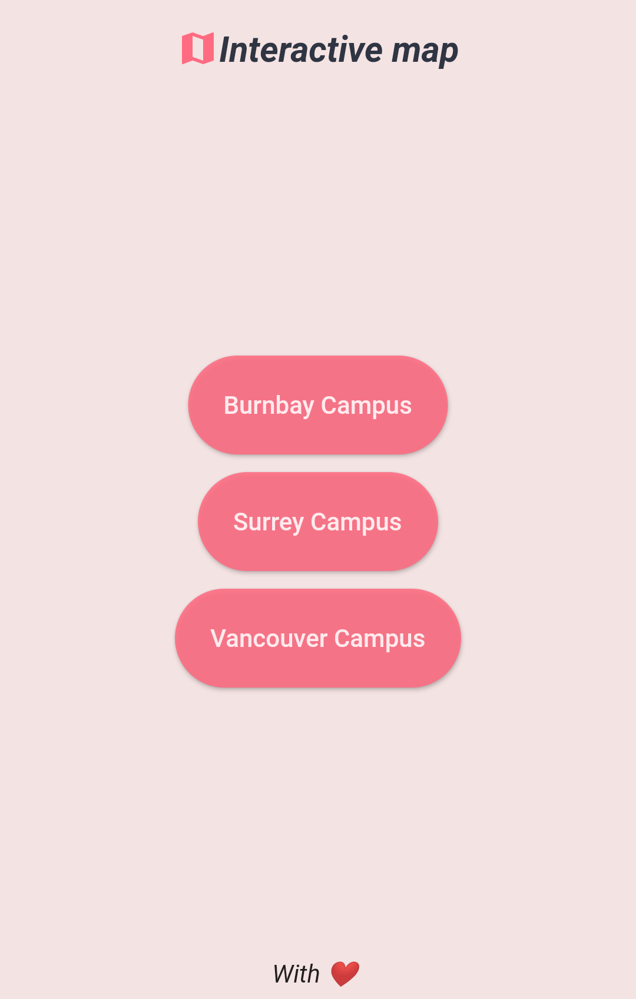
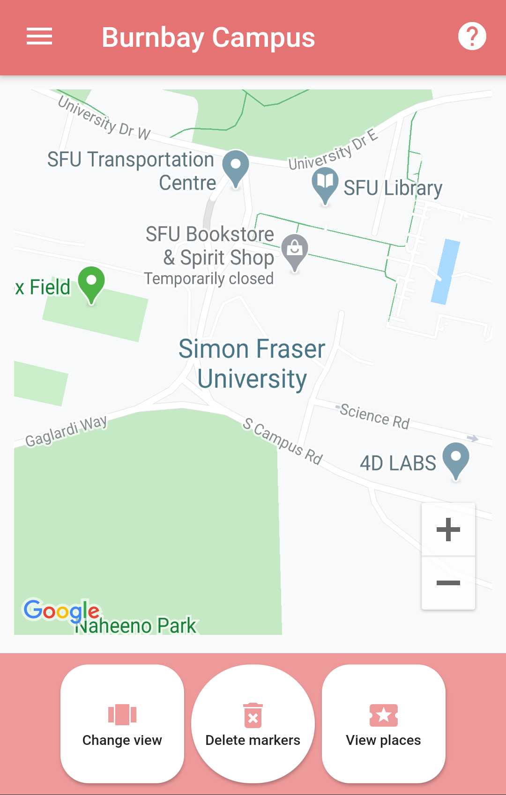
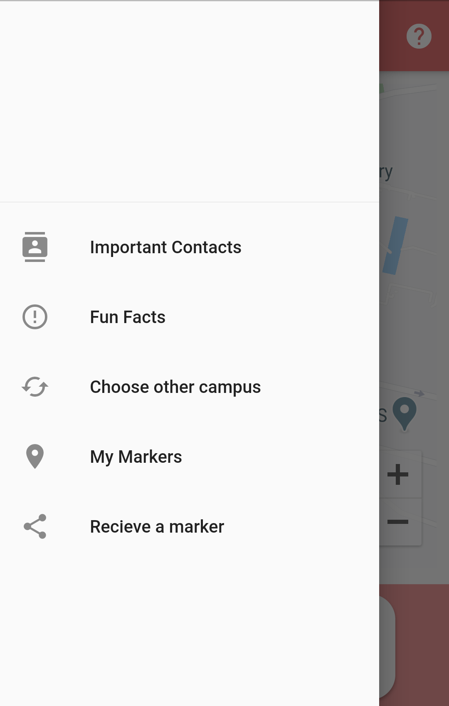
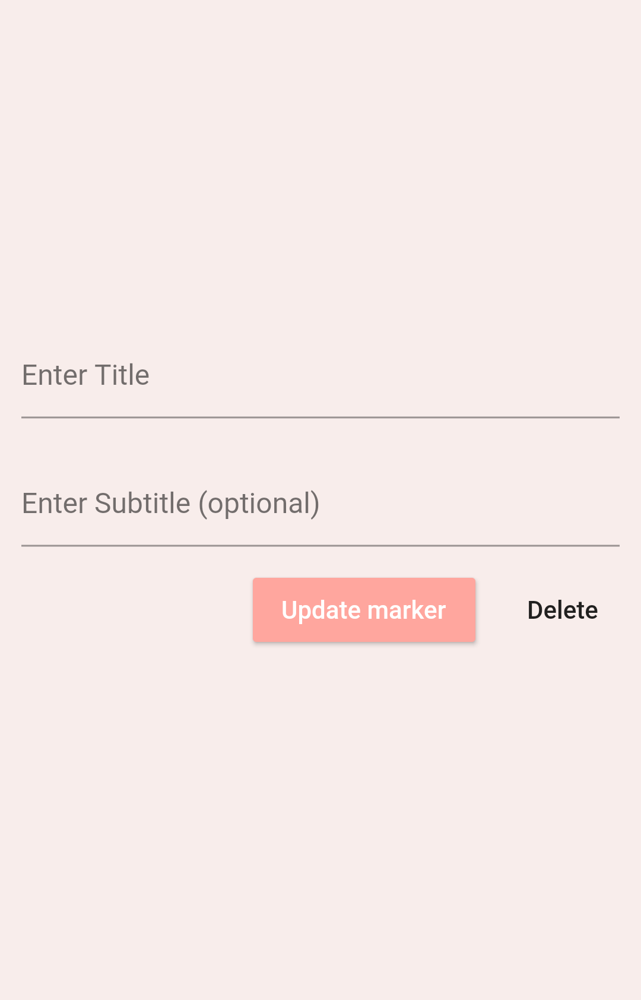
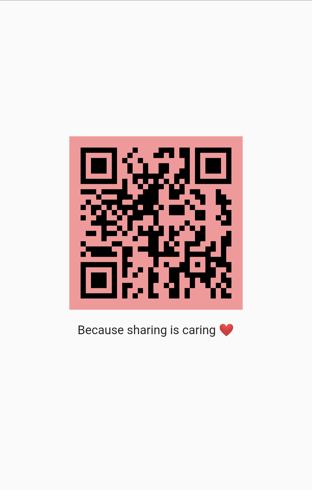
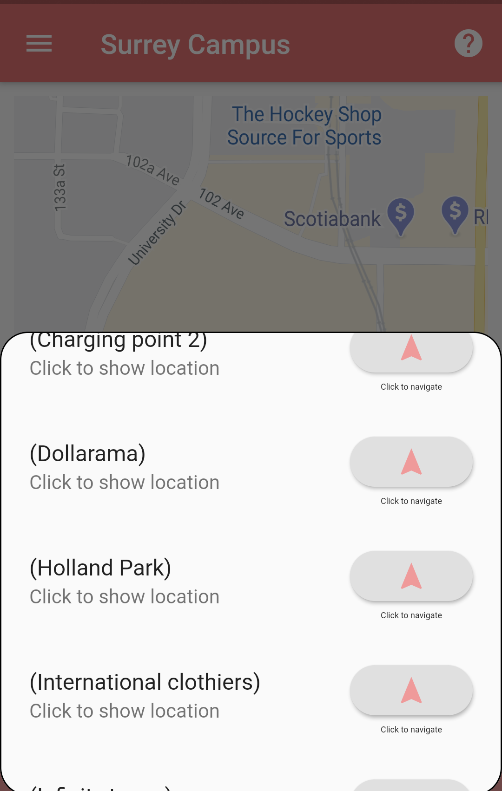
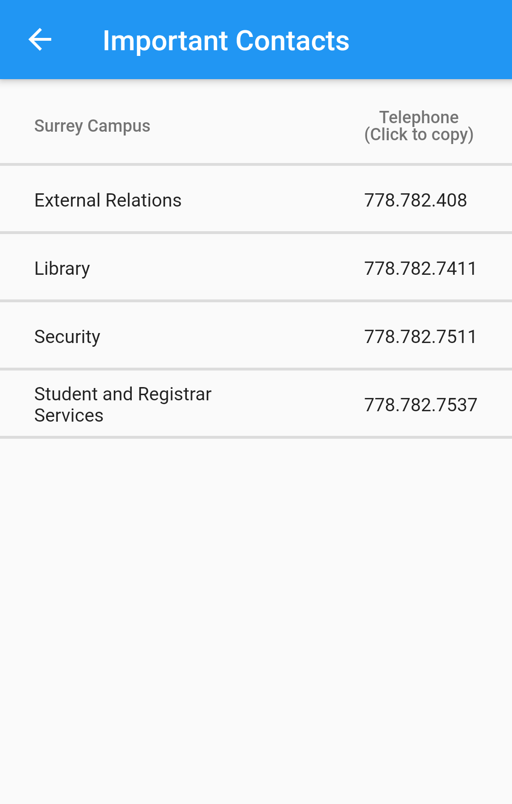
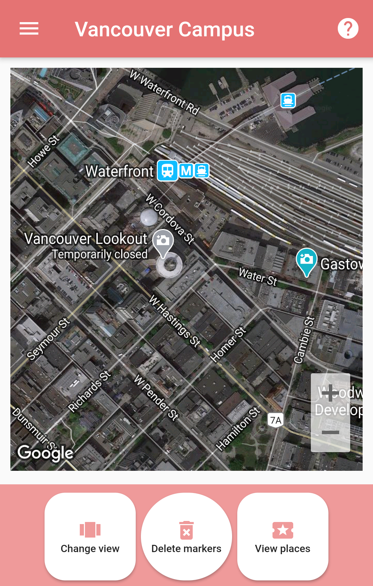

# <div align="center">SFU Interactive Map</div>

<div align="center">Interactive map for lovely campus of SFU</div>

<div align="center"></div>

# Table of Content:
- [Display Shots](#display-shots)
- [Programming Language used ](#programming-language-used)
- [Prerequisites](#prerequisites)
- [Opening the project](#opening-the-project)
- [Getting the API key](#getting-the-api-key)
- [Enabling Maps and Directions API](#enabling-maps-and-directions-api)
- [Installing](#installing)
- [Run the app](#run-the-app)
- [File Name](#file-names)
- [Key Features](#key-features)
- [Contact info](#contact-info)
## Display shots

                                   

# Programming language used

This project uses Flutter - a free and open-source mobile UI framework which uses a programming language called Dart.

## Prerequisites
1) [Install Flutter SDK](https://flutter.dev/docs/get-started/install) 
2) [Setup Editor](https://flutter.dev/docs/get-started/editor) 
3) [Setup Android Device](https://flutter.dev/docs/get-started/install/windows#set-up-your-android-device) or [Setup Android emulator](https://flutter.dev/docs/get-started/install/windows#set-up-the-android-emulator)


## Opening the project 
1.  Start Android Studio.
2.  Open plugin preferences (**Preferences > Plugins** on macOS, **File > Settings > Plugins** on Windows & Linux).
3.  Select **Browse repositories**, select the Flutter plugin and click **Install**.
4.  Click **Yes** when prompted to install the Dart plugin.
5.  Click **Restart** when prompted.
6. After that : click “Open existing Android Studio Project”

## Getting the API key
To get an API key:

1.  Visit the [Google Cloud Platform Console](https://cloud.google.com/console/google/maps-apis/overview).
2.  Click the project drop-down and select or create the project for which you want to add an API key.
3.  Click the menu button  and select **APIs & Services > Credentials**.
4.  On the **Credentials** page, click **Create credentials > API key**.  
    The **API key created** dialog displays your newly created API key.
5.  Click **Close.**  
    The new API key is listed on the **Credentials** page under **API keys**.  
   
   ## Enabling Maps and Directions API 
   1) Visit your Google Cloud Platform Console account.
   2) Open the menu button and select **APIs & Services>Dashboard**
   3) Click on **Enable API's and services** 
   4) Enable **Maps SDK for Android** and **Directions API**


## Installing

1. Get the API key 
2. Clone the repo.

`https://github.com/AshCatchEmAll/Sfu_Interactive_Map.git`

4. Install flutter SDK and Set up your editor 
5. Enter API in Keys.dart file 

`static  const directionAPI = "Put your API here"`

6. Enter Api in android>App>source>main

`android:name="com.google.android.geo.API_KEY"`

 `android:value="Put your key here"/> `
 


## Run the app
1) Locate the main Android Studio toolbar:

2.  In the **target selector**, select an Android device for running the app. If none are listed as available, select **Tools> Android > AVD Manager** and create one there. For details, see [Managing AVDs](https://developer.android.com/studio/run/managing-avds).
3. Please get and upgrade packages by typing these commands 
    - From the terminal: Run flutter pub get . OR.
    - From Android Studio/IntelliJ: Click Packages get in the action ribbon at the top of pubspec. yaml .
    - From VS Code: Click Get Packages located in right side of the action ribbon at the top of pubspec. yaml .
    
4.   Click the run icon in the toolbar, or invoke the menu item **Run > Run**.

## File names 
1. main.dart : The main file containing the first page of app 
2. Maps.dart : 	Contains the business logic for the app including displaying map , adding markers, showing routes and so on.
3. MyDrawer.dart : This file contains the code for the side menu.
4. QrShare.dart : Includes the code for sharing the markers using QR code.
5. ImportantContacts.dart : Will display important contacts according to the campus.
6. Facts.dart : very few facts about a lovely university.
7. Key.dart : Just a separate file for API
8. Help.dart : Help to navigate through the app.
9. DataBaseProvider.dart : Logic to persist data on the device 

# Key Features
- Allows users to choose between three different campus 
- Put markers on the map and name them also delete them 
- Display route between two user added markers on the map 
- Display route between user current location and selected destination
- Share Markers between devices 
- Display important contacts and ability to copy number to clipboard on tap
- Beautiful UI and ease of use

# Future Scope 
- Turn by turn navigation 
- Indoor navigation 
- Create authentication system so that only SFU students can access the app 
- Ability to see reviews about different places on campus 
- Store markers on firebase cloud so that saved markers are available across devices for authenticated users
- Make app available for ios and web

# Plugins used 
 - google_maps_flutter: ^0.5.28+1
 - geolocator: ^5.3.2+2
 - google_map_polyline:
 - location: ^3.0.2
 - sqflite: ^1.3.1
 - path:
 - flutter_map: ^0.9.0
 - flutter_polyline_points: ^0.2.2
 - android_intent: ^0.3.7+2
 - qr_flutter: ^3.1.0
 - flutter_barcode_scanner: ^1.0.1
 - Much thanks to these plugins which made this project successful :clap:
 
 # Contact info 
 ```
 avichare@sfu.ca
 ```
 
 # Members List:
 - Me, Myself and I :balloon:


